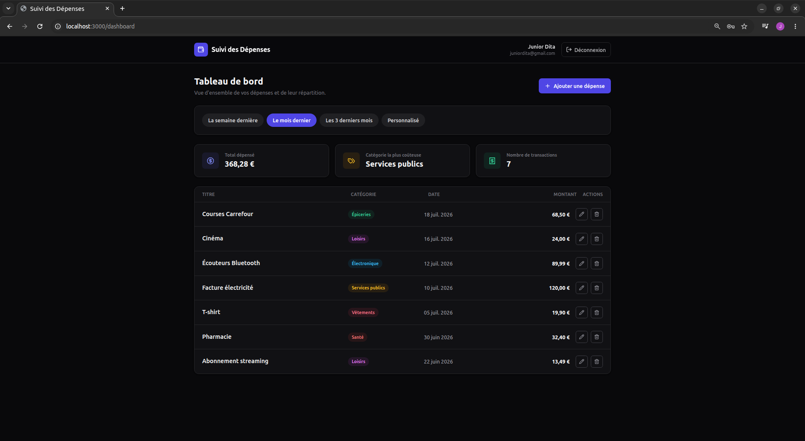

# Expense Tracker API & Application

Ce projet est une application full-stack de suivi des dépenses personnelles avec authentification sécurisée par JWT et filtrage avancé. 

Le cahier des charges et la logique métier de l'API sont issus de la roadmap backend de [roadmap.sh](https://roadmap.sh/projects/expense-tracker-api) (*Projets Backend - Niveau : Facile*).


## Présentation du projet

L'objectif principal de ce projet est de concevoir et déployer une API REST robuste couplée à une interface moderne pour la gestion des finances personnelles. L'application permet à chaque utilisateur de s'inscrire, de se connecter en toute sécurité et de gérer son budget au quotidien.

### Compétences & Technologies clés
* **Modélisation de données :** Conception d'un modèle relationnel/document pour gérer les utilisateurs et leurs dépenses associées.
* **Authentification & Sécurité :** Gestion des sessions via JSON Web Tokens (JWT) et protection des routes d'API.
* **Filtrage dynamique :** Filtrage temporel avancé sur les transactions.

---

## Fonctionnalités

### Authentification & Utilisateurs
* Inscription de nouveaux utilisateurs.
* Connexion avec génération et vérification de tokens JWT.
* Protection de l'ensemble des endpoints liés aux dépenses.

### Gestion des Dépenses (CRUD)
* **Créer :** Ajout de nouvelles dépenses avec montant, date, description et catégorie.
* **Mettre à jour :** Modification des détails d'une dépense existante.
* **Supprimer :** Retrait d'une dépense de l'historique.
* **Lister & Filtrer :** Consultation de l'historique avec prise en charge des filtres temporels :
  * La semaine passée
  * Le mois dernier
  * Les 3 derniers mois
  * Plage de dates personnalisée (Date de début - Date de fin)

### Catégories prises en charge
* Groceries (Courses)
* Leisure (Loisirs)
* Electronics (Électronique)
* Utilities (Factures & Services)
* Clothing (Vêtements)
* Health (Santé)
* Others (Autres)

---

## Architecture Technique

* **Frontend :** Next.js (App Router, Tailwind CSS)
* **Backend :** Express.js
* **Runtime :** Bun (pour des performances d'exécution et une gestion de paquets ultra-rapides)
* **Authentification :** JWT (JSON Web Tokens) & Hachage de mots de passe

---

## Navigation & Installation

### Prérequis
* [Bun](https://bun.sh/) installé sur votre machine (version 1.0 ou supérieure).

### 1. Cloner le projet
```bash
git clone [https://github.com/votre-utilisateur/votre-depot.git](https://github.com/votre-utilisateur/votre-depot.git)
cd votre-depot